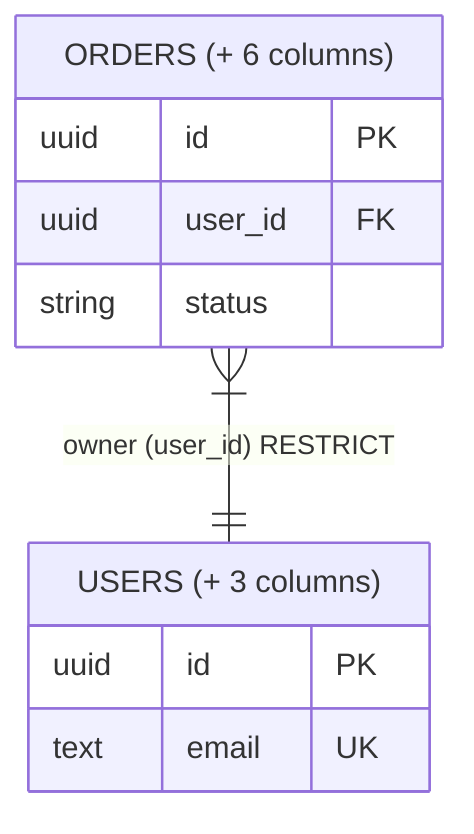

# ERD notation

Disclosed reference for [database-schema-documenter](../SKILL.md). Every chapter's ERD follows this exactly — it's what makes ERDs across different repos and different agent runs comparable.

## Cardinality

Mermaid `erDiagram` cardinality is two characters per side: the outer character is the maximum, the inner is the minimum.

| Notation | Meaning |
|---|---|
| `\|o` / `o\|` | zero or one |
| `\|\|` | exactly one |
| `}o` / `o{` | zero or more |
| `}\|` / `\|{` | one or more |

## FK edges: solid = NOT NULL, dashed = nullable

Mermaid natively distinguishes **identifying** relationships (`--`, solid) from **non-identifying** ones (`..`, dashed). This skill repurposes that exact distinction for FK nullability — not Mermaid's original "is the child's primary key derived from the parent" meaning. Don't mix the two meanings if a reader looks up Mermaid's own docs; this convention is a fixed reinterpretation, applied consistently across every chapter.

Always give every entity its attribute block, even in a two-entity example — a bare box with no columns is never correct output, only a placeholder for illustrating the edge itself.

- **NOT NULL FK (mandatory parent)** → solid line, child cardinality starts at "one" (`}|`):

  ```mermaid
  erDiagram
      ORDERS {
          uuid id PK
          uuid user_id FK
          string status
      }
      USERS {
          uuid id PK
          text email UK
      }
      ORDERS }|--|| USERS : "owner (user_id) RESTRICT"
  ```

- **Nullable FK (optional parent)** → dashed line, child cardinality starts at "zero" (`}o`):

  ```mermaid
  erDiagram
      ORDERS {
          uuid id PK
          uuid referred_by_user_id FK
          string status
      }
      USERS {
          uuid id PK
          text email UK
      }
      ORDERS }o..|| USERS : "referrer (referred_by_user_id) SET NULL"
  ```

Every edge label states three things: a short verb naming the relationship (`owns`, `for`, `assignee`, `backs`, `frozen`, `source` — whatever reads naturally), the FK column name in parentheses, and the bare `ON DELETE` rule keyword — `RESTRICT`, `CASCADE`, `SET NULL`, `SET DEFAULT`, `NO ACTION`. Don't spell out the words "ON DELETE"; the legend covers that once. Never omit the rule itself — it changes what happens to child rows, and that's exactly the kind of fact an ERD-as-summary must still surface.

A table can reference itself (e.g. a credit note pointing back at the invoice it reverses) — same solid/dashed and labeling rules apply, just with both ends on the same entity. Most self-references are nullable (most rows aren't the reversing/child case) but still restricted on delete, since the parent shouldn't disappear out from under a row that references it: `INVOICES }o..|| INVOICES : "storno_of (self) RESTRICT"`.

## Legend

Every ERD is followed immediately by a legend restating the two line styles, so a reader never has to hold the convention in their head across chapters:

```
**Legend:** Solid line = NOT NULL foreign key (parent required). Dashed line = nullable foreign key (parent optional). Edge label = relationship verb + FK column + ON DELETE rule.
```

## Filtered columns: `+ N columns`

An ERD entity block shows identifying, discriminator, key, FK, and otherwise chapter-relevant columns. If that's every column — a short table, or nothing is irrelevant to navigation — show the full column list; don't filter for filtering's sake. Mermaid's attribute rows always need a real `type`+`name` pair (neither can be empty or blank), so there's no way to fit `+ N columns` into a row without it reading as a fake column. Put it in the entity's own title instead, via Mermaid's alias syntax (`ENTITY["display label"]` — the alias is display-only; relationship lines still use the plain entity name):



A fully-shown entity (see "show the full column list" above) keeps its plain, alias-free name — only a filtered entity gets the `(+ N columns)` suffix. Never let the count go stale — it's checked against the full table schema every time the doc is regenerated or updated.

## Attribute comments and composite keys

Mermaid's attribute row syntax does support a real trailing comment (`type name key "comment"`) — a legitimate, encouraged way to annotate a real column inline: enum values (`"normal / extra"`), a business rule stated directly (`"currency follows account locale"`), or a still-open question (`"OPEN: should EUR accounts allow GBP too?"`). State the rule itself rather than citing a closed decision's code — see table-schema-format.md's "State why, not where." Use it freely on real columns; it's not a place to invent a fake column for a note that isn't about any real column (see the `+ N columns` fix above). Comment text can never contain a literal double-quote — Mermaid's parser breaks on it — so a quoted value or string inside a note must be rewritten with single quotes instead.

When a column is simultaneously the entity's primary key and a foreign key (an owning 1:1 relationship, e.g. an `entitlements` row keyed directly by `user_id`), mark both in the key field: `uuid user_id PK,FK`.

## Cross-chapter tables

A table already fully schema'd in another chapter can still appear on a different chapter's ERD (same entity block, same rules above). Don't repeat its table schema — replace the schema section for that table with a pointer: `→ full schema in Chapter 2: Orders`.

## Hub chapter referrers

The hub chapter's ERD draws the hub table(s) plus each table that directly references them, for navigational value — but a referrer's real schema-writing home is always its assigned chapter (see SKILL.md's "Decide flat vs. chaptered"), never the hub chapter, regardless of which chapter draws it first. Mark a referrer shown on the hub chapter's ERD with the same cross-chapter pointer used above if its real home is a different chapter.

If a hub has too many direct referrers to draw legibly, cap the diagram and note what's missing — the same principle as `+ N columns`, applied to referring entities instead of columns: draw the most significant referrers, then add a caption `+ N more referencing tables (see their own chapters)`.

## Not-yet-implemented tables

A table referenced but not yet real in ground truth (see SKILL.md's "Mark what isn't real yet") gets the same alias treatment as `+ N columns`: `ENTITY["ENTITY (planned)"]`. Combine both suffixes if a planned table's ERD entry is also filtered, e.g. `ORDERS["ORDERS (planned, + 4 columns)"]`.
