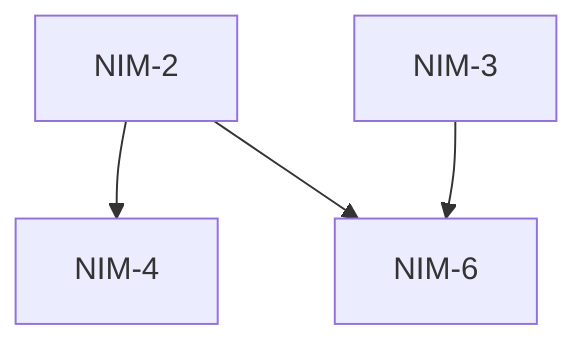

# To Issues

Break a plan into independently-grabbable issues using vertical slices (tracer bullets).

The issue tracker and triage label vocabulary should have been provided to you — run `/setup-matt-pocock-skills` if not.

## Process

### 1. Gather context

Work from whatever is already in the conversation context. If the user passes an issue reference (issue number, URL, or path) as an argument, fetch it from the issue tracker and read its full body and comments.

### 2. Explore the codebase (optional)

If you have not already explored the codebase, do so to understand the current state of the code. Issue titles and descriptions should use the project's domain glossary vocabulary, and respect ADRs in the area you're touching.

### 3. Draft vertical slices

Break the plan into **tracer bullet** issues. Each issue is a thin vertical slice that cuts through ALL integration layers end-to-end, NOT a horizontal slice of one layer.

Slices may be 'HITL' or 'AFK'. HITL slices require human interaction, such as an architectural decision or a design review. AFK slices can be implemented and merged without human interaction. Prefer AFK over HITL where possible.

<vertical-slice-rules>
- Each slice delivers a narrow but COMPLETE path through every layer (schema, API, UI, tests)
- A completed slice is demoable or verifiable on its own
- Prefer many thin slices over few thick ones
</vertical-slice-rules>

### 4. Quiz the user

Present the proposed breakdown as a markdown table so the same block can be reused in step 6. Use these columns:

| Issue | Title | Type | Label | Blocked by | User stories |
|-------|-------|------|-------|------------|--------------|

- **Issue**: the tracker identifier once published; before publishing, use a placeholder (slice 1, 2, 3…)
- **Title**: short descriptive name
- **Type**: HITL / AFK
- **Label**: the triage label that will be applied (`ready-for-agent`, `hitl`, …)
- **Blocked by**: which other slices must complete first; use `—` for none
- **User stories**: which user stories this addresses (story numbers, if the source material has them)

Ask the user:

- Does the granularity feel right? (too coarse / too fine)
- Are the dependency relationships correct?
- Should any slices be merged or split further?
- Are the correct slices marked as HITL and AFK?

Iterate until the user approves the breakdown.

### 5. Publish the issues to the issue tracker

For each approved slice, publish a new issue to the issue tracker. Use the issue body template below. These issues are considered ready for AFK agents, so publish them with the correct triage label unless instructed otherwise.

Publish issues in dependency order (blockers first) so you can reference real issue identifiers in the "Blocked by" field.

<issue-template>
## Parent

A reference to the parent issue on the issue tracker (if the source was an existing issue, otherwise omit this section).

## What to build

A concise description of this vertical slice. Describe the end-to-end behavior, not layer-by-layer implementation.

Avoid specific file paths or code snippets — they go stale fast. Exception: if a prototype produced a snippet that encodes a decision more precisely than prose can (state machine, reducer, schema, type shape), inline it here and note briefly that it came from a prototype. Trim to the decision-rich parts — not a working demo, just the important bits.

## Acceptance criteria

- [ ] Criterion 1
- [ ] Criterion 2
- [ ] Criterion 3

## Blocked by

- A reference to the blocking ticket (if any)

Or "None - can start immediately" if no blockers.

</issue-template>

### 6. Append the dependency map to the PRD ticket

Only do this if the source was an existing PRD / parent issue (i.e. the user passed an issue reference in step 1). If the breakdown came from raw conversation context with no parent ticket, skip this step — there is nothing to append to.

Run this AFTER the issues are published, so the table can reference real issue identifiers.

Append a `## Dependency map` section to the **end** of the PRD ticket's body. Use a story-traceability variant of the step 4 table — **add** the `User stories` column (mapped against the PRD's own user-story list, so orphan stories become visible) and **drop** the `Label` column (it lives on each issue and is not a PRD-level concern):

| Issue | Title | Type | Blocked by | User stories |
|-------|-------|------|------------|--------------|

Below the table, include a Mermaid dependency graph so the shape of the DAG (roots, leaves, depth) is readable at a glance:

This edit is append-only and idempotent:

- Do NOT alter the rest of the PRD body, change its status, or close it.
- If a `## Dependency map` section already exists (e.g. on a re-run), replace it in place rather than appending a duplicate.

Do NOT close the parent issue or alter its existing content. The only permitted modification is appending (or replacing) the `## Dependency map` section described above.
